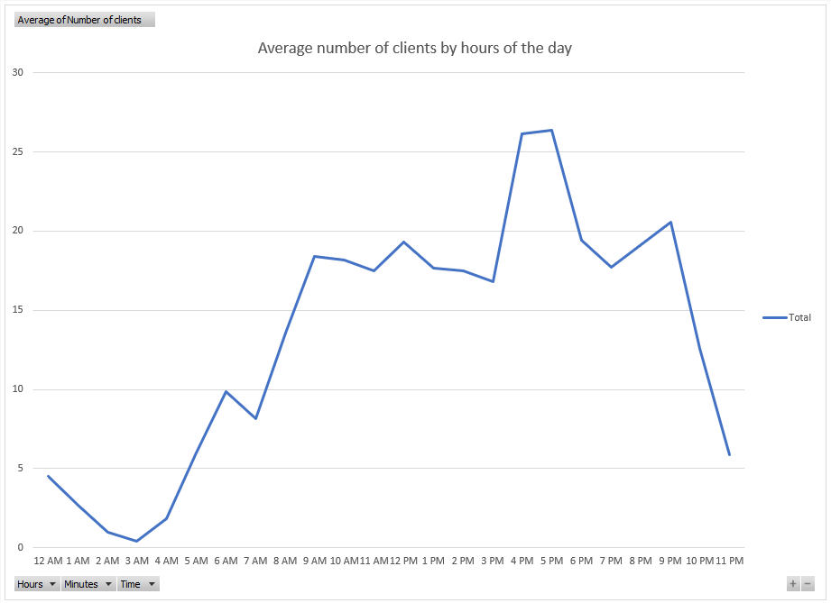

# Gym scraper

## Overview

This Python script allows you to perform web scraping on a gym website to extract data using the `lxml` library. The script retrieves specific information from the website and logs it into a CSV file, enabling you to track changes over time.

*Data from script ran each hour of July 2022*
